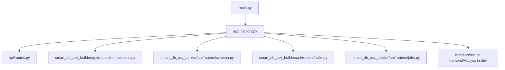
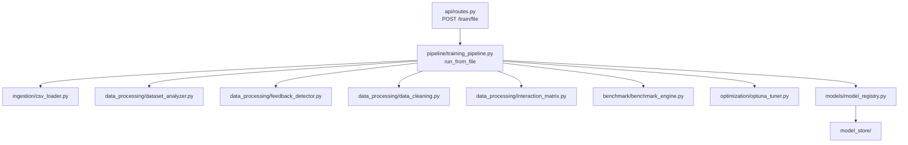
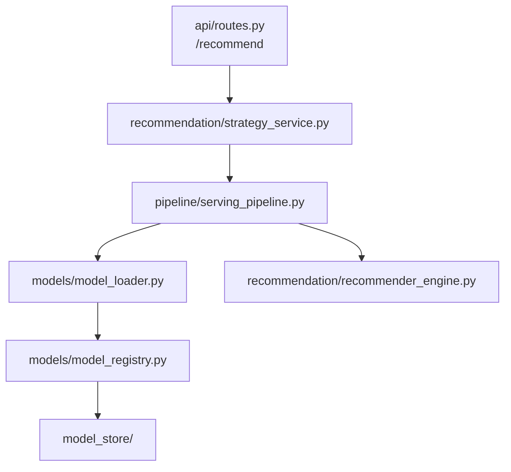

# Project Flow Diagram

This file shows which file connects to which file in this project.

## 1. Top-Level App Wiring



Meaning:

- `main.py` starts the app.
- `app_factory.py` is the central connection point.
- It mounts:
  - the main training/recommendation routes
  - the Smart DB CSV Builder routes
  - the frontend

## 2. Database Mode Flow

This is the path when you use live database connections.

```mermaid
flowchart LR
    A[frontend/App.jsx<br/>PageConnections] --> B[/smart-db-csv/api/connections]
    A --> C[/smart-db-csv/api/schema/{conn_id}]
    B --> D[smart_db_csv_builder/api/routers/connections.py]
    C --> E[smart_db_csv_builder/api/routers/schema.py]
    D --> F[smart_db_csv_builder/core/connection_store.py]
    E --> F
    F --> G[smart_db_csv_builder/connectors/*]
```

Meaning:

- `frontend/App.jsx` sends connection requests.
- Builder routers handle those requests.
- `connection_store.py` keeps the registered connections in memory.
- Connector files in `smart_db_csv_builder/connectors/` talk to the actual databases.

## 3. Dataset Build Flow

This is the main `smart_db_csv_builder` flow.

```mermaid
flowchart TD
    A[frontend/App.jsx<br/>PageBuild] --> B[POST /smart-db-csv/api/build]
    B --> C[smart_db_csv_builder/api/routers/build.py]
    C --> D[smart_db_csv_builder/services/builder.py<br/>run_build_job]
    D --> E[smart_db_csv_builder/services/llm_planner.py]
    D --> F[smart_db_csv_builder/services/executor.py<br/>execute_plan]
    F --> G[smart_db_csv_builder/core/connection_store.py]
    G --> H[smart_db_csv_builder/connectors/*]
    F --> I[temp CSV/JSON files]
    D --> J[smart_db_csv_builder/core/job_store.py]
    J --> K[smart_db_csv_builder/api/routers/jobs.py]
    K --> L[GET /smart-db-csv/api/jobs/{job_id}/download]
```

Meaning:

- `build.py` starts the background dataset job.
- `builder.py` orchestrates the work.
- `llm_planner.py` creates the plan in LLM/query/manual modes.
- `executor.py` fetches data, merges it, and writes CSV/JSON output.
- `job_store.py` tracks build progress and output file paths.
- `jobs.py` lets the frontend poll the job and download the result.

## 4. How The Builder Connects To Training

This is the important handoff.

```mermaid
flowchart LR
    A[smart_db_csv_builder/api/routers/jobs.py<br/>download endpoint] --> B[frontend/App.jsx<br/>fetch built CSV]
    B --> C[new File(blob, built_dataset.csv)]
    C --> D[frontend/App.jsx<br/>PageTrain]
    D --> E[POST /train/file]
    E --> F[api/routes.py]
    F --> G[pipeline/training_pipeline.py<br/>run_from_file]
```

Meaning:

- The builder does **not** directly call `TrainingPipeline`.
- The frontend downloads the built CSV.
- The frontend converts that CSV to a browser `File`.
- Then the frontend uploads it into the training API.

So the connection is:

`smart_db_csv_builder` -> downloaded CSV -> frontend `File` -> `/train/file` -> training pipeline

## 5. Training Flow



Meaning:

- `api/routes.py` receives the file upload.
- `training_pipeline.py` runs the full ML pipeline.
- The trained models are saved through `models/model_registry.py`.
- Model artifacts end up in `model_store/`.

## 6. Recommendation Flow



Meaning:

- `/recommend` is handled in `api/routes.py`.
- `strategy_service.py` decides which model or models to use.
- `serving_pipeline.py` loads the chosen model.
- `model_loader.py` and `model_registry.py` resolve files from `model_store/`.
- `recommender_engine.py` produces the final recommendations.

## 7. File-to-File Connection Map

Use this as the shortest answer to "which file connects where?"

```text
main.py
  -> app_factory.py

app_factory.py
  -> api/routes.py
  -> smart_db_csv_builder/api/routers/connections.py
  -> smart_db_csv_builder/api/routers/schema.py
  -> smart_db_csv_builder/api/routers/build.py
  -> smart_db_csv_builder/api/routers/jobs.py
  -> frontend

frontend/App.jsx
  -> smart_db_csv_builder API endpoints
  -> api/routes.py /train/file
  -> api/routes.py /recommend

smart_db_csv_builder/api/routers/build.py
  -> smart_db_csv_builder/services/builder.py

smart_db_csv_builder/services/builder.py
  -> smart_db_csv_builder/services/llm_planner.py
  -> smart_db_csv_builder/services/executor.py
  -> smart_db_csv_builder/core/connection_store.py
  -> smart_db_csv_builder/core/job_store.py

smart_db_csv_builder/services/executor.py
  -> smart_db_csv_builder/connectors/*
  -> temp CSV/JSON output

api/routes.py
  -> pipeline/training_pipeline.py
  -> recommendation/strategy_service.py
  -> pipeline/serving_pipeline.py

pipeline/training_pipeline.py
  -> ingestion/*
  -> data_processing/*
  -> benchmark/benchmark_engine.py
  -> optimization/optuna_tuner.py
  -> models/model_registry.py

recommendation/strategy_service.py
  -> pipeline/serving_pipeline.py

pipeline/serving_pipeline.py
  -> models/model_loader.py
  -> models/model_registry.py
  -> recommendation/recommender_engine.py
```

## 8. One-Line Summary

If you use database mode, the project flow is:

`frontend/App.jsx` -> `smart_db_csv_builder` routers/services -> built CSV -> `frontend/App.jsx` -> `api/routes.py /train/file` -> `pipeline/training_pipeline.py` -> `models/model_registry.py` -> `api/routes.py /recommend`
